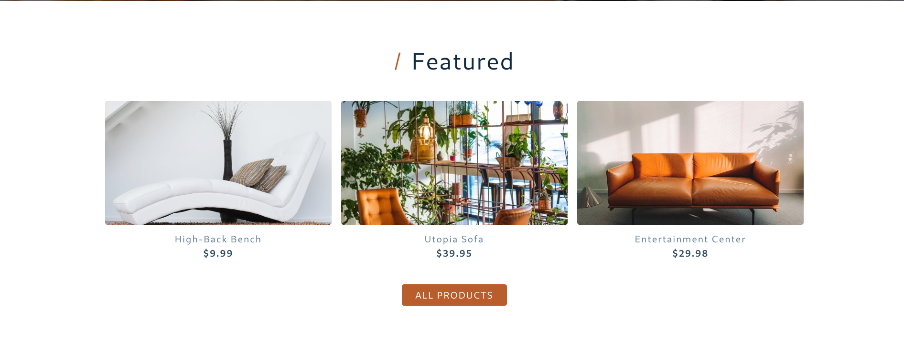
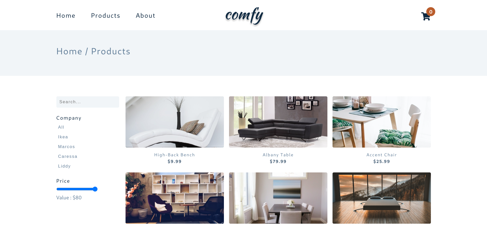
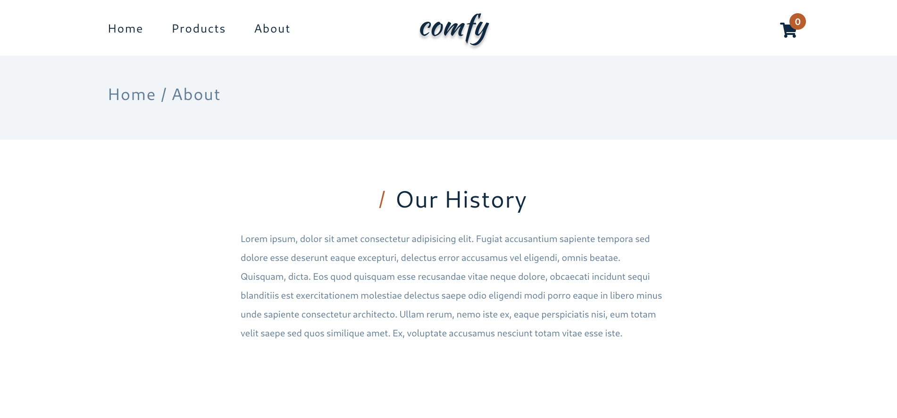

# Comfy Project

The best project made by HTML, CSS, and JavaScript.

## Home Page




## Products Page



## About Page



---

## Cloning the project 🪛🔨

```bash
# Clone this repository
$ git clone https://github.com/MastooraTurkmen/Comfy-Store.git

# Go inside the repository
$ cd Comfy-Store
```

---

## Languages and Tools are used 🗣️🔧


1. **Languages** 🗣️

    + [HTML](https://github.com/topics/html)
    + [HTML5](https://github.com/topics/html5)
    + [CSS](https://github.com/topics/css)
    + [CSS3](https://github.com/topics/css3)
    + [JavaScript](https://github.com/topics/javascript)

2. **Tools** 🔧

    + [Chrome](https://github.com/topics/chrome)
    + [VSCode](https://github.com/topics/vscode)
    + [Netlify](https://github.com/topics/netlify)
    + [API](https://github.com/topics/api)

-----


## Deployment 📥

1. How to deploy our project to the ***Netlify*** site?
2. I use [Netlify App](https://app.netlify.com/) for deploying my projects.
3. Go to the Netlify site and select Add a new site.
4. From there select **_Deploy with Github_**.
5. Then write your project name and select it.
6. After selecting here you can see that the project **_Review configuration for Comfy-Store_** and then select the **_Deploy Comfy-Store_** Button.
7. Now your project is Live.

-----

## Author 👩🏻‍💻

***Mastoora Turkmen***

[LinkedIn](https://www.linkedin.com/in/mastoora-turkmen/) 
